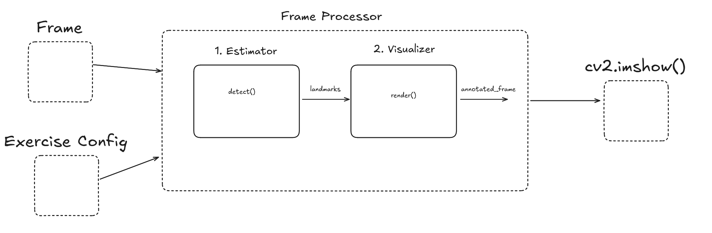

# Milon Exercise Engine

AI-powered exercise rep counter built on MediaPipe pose estimation. Designed to run as a Python package that plugs into any front-end — Streamlit dashboard, Raspberry Pi script, or a standalone cv2 window.



## Requirements

- Python 3.10+
- Webcam or video file

## Setup

```bash
# 1. Clone
git clone https://github.com/ieee-sb-uniwa/milon-exercise-engine.git
cd milon-exercise-engine

# 2. Create and activate a virtual environment
python -m venv .venv
source .venv/bin/activate   # Windows: .venv\Scripts\activate

# 3. Install the package and its dependencies
pip install -e .
```

Dependencies (`mediapipe`, `opencv-python`, `numpy`, `pyyaml`) are installed automatically.

## Project structure

```
milon_engine/
├── core/
│   ├── models.py           # ExerciseResult dataclass
│   ├── pose_estimator.py   # MediaPipe wrapper  →  detect(frame)
│   ├── visualizer.py       # Drawing layer      →  render(frame, results, result)
│   └── frame_processor.py  # Orchestrator       →  process_frame(frame)
├── exercises/
│   ├── base.py             # Abstract Exercise base class
│   ├── squat.py
│   ├── pushup.py
│   └── legraise.py
├── configs/                # Per-exercise YAML configs
│   ├── squat.yaml
│   ├── pushup.yaml
│   └── legraise.yaml
└── utils/
    └── config.py           # load_config() helper
```

## Quick start

### Webcam window (cv2)

```python
import cv2
from milon_engine import FrameProcessor, PoseEstimator, Visualizer, Squat, load_config

config    = load_config("squat")
exercise  = Squat(config, fps=30.0, calibration_path="outputs/calibration/squat.yaml")
processor = FrameProcessor(exercise, PoseEstimator(), Visualizer())

cap = cv2.VideoCapture(0)
while True:
    ret, frame = cap.read()
    if not ret:
        break
    annotated = processor.process_frame(frame)
    cv2.imshow("Milon", annotated)
    if cv2.waitKey(1) & 0xFF == ord("q"):
        break

cap.release()
cv2.destroyAllWindows()
```

### Streamlit

```python
import cv2, streamlit as st
from milon_engine import FrameProcessor, PoseEstimator, Visualizer, Squat, load_config

config    = load_config("squat")
exercise  = Squat(config, fps=30.0, calibration_path="outputs/calibration/squat.yaml")
processor = FrameProcessor(exercise, PoseEstimator(), Visualizer())

frame_placeholder = st.empty()
cap = cv2.VideoCapture(0)
while True:
    ret, frame = cap.read()
    if not ret:
        break
    annotated = processor.process_frame(frame)
    frame_placeholder.image(annotated, channels="BGR")
```

## Calibration

Each exercise needs a calibration YAML that defines the down/up angle thresholds for your specific setup. Place them under `outputs/calibration/<exercise_name>.yaml`.

Example (`outputs/calibration/squat.yaml`):

```yaml
down_threshold: 95.0
up_threshold: 160.0
down_shift_delta: 0.03
up_shift_delta: 0.01
```

## Supported exercises

| Exercise | Config key | Landmarks used |
|----------|------------|----------------|
| Squat    | `squat`    | Hip – Knee – Ankle |
| Push-up  | `pushup`   | Shoulder – Elbow – Wrist |
| Leg raise | `legraise` | Hip – Knee – Ankle |

## License

MIT
