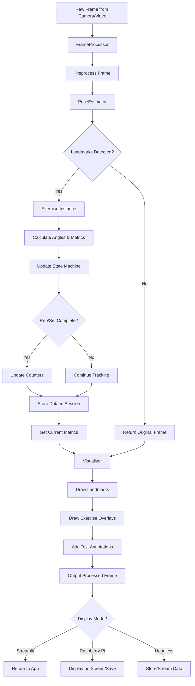

```mermaid
graph TD
    A[Raw Frame from Camera/Video] --> B[FrameProcessor]
    B --> C[Preprocess Frame]
    C --> D[PoseEstimator]
    D --> E{Landmarks Detected?}

    E -->|No| F[Return Original Frame]
    E -->|Yes| G[Exercise Instance]

    G --> H[Calculate Angles & Metrics]
    H --> I[Update State Machine]
    I --> J{Rep/Set Complete?}

    J -->|Yes| K[Update Counters]
    J -->|No| L[Continue Tracking]

    K --> M[Store Data in Session]
    L --> M
    M --> N[Get Current Metrics]

    N --> O[Visualizer]
    F --> O

    O --> P[Draw Landmarks]
    P --> Q[Draw Exercise Overlays]
    Q --> R[Add Text Annotations]
    R --> S[Output Processed Frame]

    S --> T{Display Mode?}
    T -->|Streamlit| U[Return to App]
    T -->|Raspberry Pi| V[Display on Screen/Save]
    T -->|Headless| W[Store/Stream Data]
```
